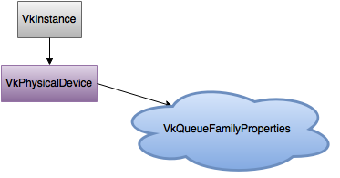

# Create a (Logical) Device

<link href="../css/lg_stylesheet.css" rel="stylesheet"></link>

Code file for this section is `03-init_device.cpp`

The next step is to create a `VkDevice` logical device object
which corresponds to one of the physical devices on the system.
The logical device is a key object used later to direct graphics commands
to the hardware.

So far, our samples have determined how many physical devices you have.
The samples utility function for enumerating the devices
has made sure that there is at least one, else it would have
stopped with an untrue assertion.

## Picking a Device

To make things simple, the samples just take the first device from
the list returned in the device enumeration.  You can see this in the
`device` program where it uses `info.gpus[0]`.
A more complex program may need extra effort to decide which
device(s) to use if there are more than one.
Here, the samples are simply assuming that the first device on the list
is sufficient for the purposes of the sample.

Now that you've picked a physical device, you need to create the `VkDevice`,
or logical device object.
But to do that, you need to supply some information about queues.

## Device Queues and Queue Families

Unlike other graphics APIs, Vulkan exposes device queues to the programmer
so that the programmer can decide how many queues to use and what types
of queues to use.

A queue is the abstracted mechanism used to submit commands to the
hardware.  You will see later how a Vulkan application builds up
a command buffer full of commands and then submits them onto a
queue for asynchronous processing by the GPU hardware.

Vulkan arranges queues according to their type into queue families.
In order to find the type and characteristics of a queue you are
interested in, you query the QueueFamilyProperties from the
physical device:

    typedef struct VkQueueFamilyProperties {
        VkQueueFlags    queueFlags;
        uint32_t        queueCount;
        uint32_t        timestampValidBits;
        VkExtent3D      minImageTransferGranularity;
    } VkQueueFamilyProperties;

    typedef enum VkQueueFlagBits {
        VK_QUEUE_GRAPHICS_BIT = 0x00000001,
        VK_QUEUE_COMPUTE_BIT = 0x00000002,
        VK_QUEUE_TRANSFER_BIT = 0x00000004,
        VK_QUEUE_SPARSE_BINDING_BIT = 0x00000008,
    } VkQueueFlagBits;

The sample program proceeds by making the following call to
obtain the queue information:

    vkGetPhysicalDeviceQueueFamilyProperties(
        info.gpus[0], &info.queue_family_count, info.queue_props.data());

`info.queue_props` is a vector of `VkQueueFamilyProperties`.
You can inspect the sample code to see that the sample
follows the pattern described in the [Enumerate Devices](02-enumerate_devices.html) section
explaining how to get lists of objects with the Vulkan API.
It calls `vkGetPhysicalDeviceQueueFamilyProperties` once to get the count, and
calls it again to get the data.

The `VkQueueFamilyProperties` structure is called a "family"
because there may be many (`queueCount`) queues
available with a specific set of `queueFlags`.  For example, there may be
8 queues in a family that has the `VK_QUEUE_GRAPHICS_BIT` set.

The queues and queue families on such a device might look like:

The `VkQueueFlagBits` indicate what sorts of workloads each hardware
queue can handle.
For example, a device may define a queue family that sets
`VK_QUEUE_GRAPHICS_BIT` for normal 3D graphics work.
But if the same device has specialized hardware for doing
pixel block copies (blits),
it may define another queue family with just the `VK_QUEUE_TRANSFER_BIT`
set.
This makes it possible for the hardware to process graphics
workloads in parallel with blit workloads.

Note that there is also a queue type for compute operations,
which is not covered in this tutorial.

Some simpler GPU hardware may advertise only a single queue family
with multiple queue type flags set:

For now, assume that the sample programs are really only interested in drawing
simple graphics, so they just need to look for the graphics bit:

    bool found = false;
    for (unsigned int i = 0; i < info.queue_family_count; i++) {
        if (info.queue_props[i].queueFlags & VK_QUEUE_GRAPHICS_BIT) {
            queue_info.queueFamilyIndex = i;
            found = true;
            break;
        }
    }

It is important to note that a queue family is not represented with
a handle, but with an index instead.

Once you have picked a queue family index, you fill out the rest of the structure:

    float queue_priorities[1] = {0.0};
    queue_info.sType = VK_STRUCTURE_TYPE_DEVICE_QUEUE_CREATE_INFO;
    queue_info.pNext = NULL;
    queue_info.queueCount = 1;
    queue_info.pQueuePriorities = queue_priorities;

More complex programs may wish to submit graphics commands on
more than one queue, if more than one is available.
But since the samples are simple, you only need to ask for one here.
Because there is only one queue, the values placed in `queue_priorities[]`
are unimportant.

## Creating the Logical Device

With the question of queues settled, creating the logical device
is straightforward:

    VkDeviceCreateInfo device_info = {};
    device_info.sType = VK_STRUCTURE_TYPE_DEVICE_CREATE_INFO;
    device_info.pNext = NULL;
    device_info.queueCreateInfoCount = 1;
    device_info.pQueueCreateInfos = &queue_info;
    device_info.enabledExtensionCount = 0;
    device_info.ppEnabledExtensionNames = NULL;
    device_info.enabledLayerCount = 0;
    device_info.ppEnabledLayerNames = NULL;
    device_info.pEnabledFeatures = NULL;

    VkDevice device;
    VkResult res = vkCreateDevice(info.gpus[0], &device_info, NULL, &device);
    assert(res == VK_SUCCESS);

At this point in the tutorial, you do not need to worry much about extensions.
You will get the chance to use extensions shortly.

As for layers, device layers were recently deprecated in Vulkan, so you should never
have to specify any layers when creating a device.

Now that you have a device, you are ready to prepare it to accept graphics commands
by creating a command buffer.

<table border="1" width="100%">
    <tr>
        <td align="center" width="33%">Previous: <a href="02-enumerate_devices.html" title="Prev">Enumerate</a></td>
        <td align="center" width="33%">Back to: <a href="index.html" title="Index">Index</a></td>
        <td align="center" width="33%">Next: <a href="04-init_command_buffer.html" title="Next">Command Buffer</a></td>
    </tr>
</table>
<footer>&copy; Copyright 2016 LunarG, Inc</footer>
