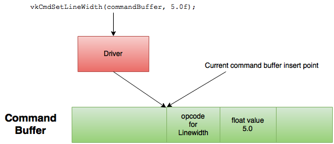

# Create a Command Buffer

<link href="../css/lg_stylesheet.css" rel="stylesheet"></link>

Code file for this section is `04-init_command_buffer.cpp`

## Basic Command Buffer Operation

In other graphics APIs, an application might set an attribute such
as line width by making an API call like `glLineWidth()`.
Under the covers, the driver translates this API call into a GPU-specific
command and puts the command into a command buffer.
The driver also manages the command buffers, by creating and
destroying them, out of view of the application.
Eventually, the driver "submits" the command buffer to the
GPU to process the commands.

In Vulkan, you create a command buffer and make a similar Vulkan API
call `vkCmdSetLineWidth()` to add a command to the command buffer.
Since each GPU has its own "instruction set", the driver still needs
to do a little work to generate the GPU-specific instructions to set
the line width.

Here, the driver determines the appropriate binary GPU instructions to
insert into the command buffer to instruct the GPU to use a line width
of 5 to draw subsequent lines.
You don't need to see the actual command buffer contents since the driver is doing this
part of the GPU programming for you.

### Command Buffer Pools

The next step is to learn how to get a command buffer.
Take a look at the `04-init_command_buffer.cpp` file in the samples
repository for this section.

Since creating and destroying individual command buffers can be
expensive, Vulkan uses command buffer pools to manage command buffers.
The motivations for using a command buffer pool include:

1. Some applications use short-lived command buffers, meaning that they are
created and destroyed frequently.
Specialized pool allocators can generally handle these allocation patterns more efficiently.

1. Command buffer memory is special in that it must be visible to
both the CPU and GPU.
In many systems, the mapping of memory to processors (CPU or GPU)
can only be done using large granularities, which implies that a small
command buffer may waste a lot of memory.

1. Memory mapping is expensive because it usually involves
modifying page tables and invalidating TLB caches.
It is better to map a larger command buffer pool once and sub-allocate
individual command buffers within it, rather than map each command
buffer separately.

#### Command Buffer Pools and Queue Families

A driver allocates a command buffer pool using memory allocation
attributes that are appropriate for the GPU hardware that reads
the command buffer memory.
Examples of such attributes include memory alignment requirements
and cache behavior.

If there is more than one hardware queue in the GPU hardware,
as described by the physical device queue families, then
the driver might need to allocate command buffer pools with
different memory allocation attributes, specific to each GPU
hardware queue.
These details are handled for you by the driver as long as it
knows the queue family containing the queue that the command buffer will use.

This also means that a command buffer pool can be associated with only one
queue family.
This requirement shows up in the API design via the code needed to create a command
buffer pool, where you specify the queue family index:

    VkCommandPoolCreateInfo cmd_pool_info = {};
    cmd_pool_info.sType = VK_STRUCTURE_TYPE_COMMAND_POOL_CREATE_INFO;
    cmd_pool_info.pNext = NULL;
    cmd_pool_info.queueFamilyIndex = info.graphics_queue_family_index;
    cmd_pool_info.flags = 0;

    res = vkCreateCommandPool(info.device, &cmd_pool_info, NULL, &info.cmd_pool);

Note that you decided what queues to use when you created the device
in the [previous section](03-init_device.html).
Effectively, you would have to create a command buffer pool for
each unique queue family that the application intends to use.
Since you specified only one queue family when you created the device,
one command buffer pool suffices for these samples.

## Creating the Command Buffer

Once a command buffer pool is created, allocating a command buffer
from that pool is easy:

    VkCommandBufferAllocateInfo cmd = {};
    cmd.sType = VK_STRUCTURE_TYPE_COMMAND_BUFFER_ALLOCATE_INFO;
    cmd.pNext = NULL;
    cmd.commandPool = info.cmd_pool;
    cmd.level = VK_COMMAND_BUFFER_LEVEL_PRIMARY;
    cmd.commandBufferCount = 1;

    res = vkAllocateCommandBuffers(info.device, &cmd, &info.cmd);

Note that this API call is designed to make it easy to allocate
more than one command buffer in a single call.
This can be useful for applications that need many command buffers.
But the samples are simple enough to need only one.

## Using Command Buffers

Once you have created a command buffer, you start "recording" into it by calling
`vkBeginCommandBuffer()`.
Calling this function puts the command buffer into "recording" state and allows you
to call one of the many "vkCmd*" functions that insert commands into the command buffer.
You have already seen the `vkCmdSetLineWidth()` example here in this section.
Another example is `vkCmdDraw()`, which tells the GPU to draw some vertices.
When you are finished inserting commands into the command buffer, you call
`vkEndCommandBuffer()` to indicate you are done and take the command buffer out
of recording state and make it ready for use.

You will see code that actually populates command buffers in later sections.

Finishing the command buffer recording does not make the GPU do anything.
In order for the GPU to process a command buffer, you must submit it onto the GPU's
queue using `vkQueueSubmit()`.
There are still a lot of things to set up before you can submit a command
buffer to the GPU, which will happen in the final section of this tutorial.

<table border="1" width="100%">
    <tr>
        <td align="center" width="33%">Previous: <a href="03-init_device.html" title="Prev">Device</a></td>
        <td align="center" width="33%">Back to: <a href="index.html" title="Index">Index</a></td>
        <td align="center" width="33%">Next: <a href="05-init_swapchain.html" title="Next">Swapchain</a></td>
    </tr>
</table>
<footer>&copy; Copyright 2016 LunarG, Inc</footer>
